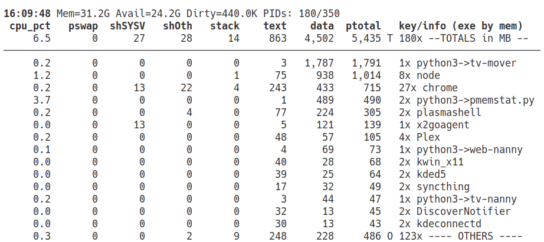
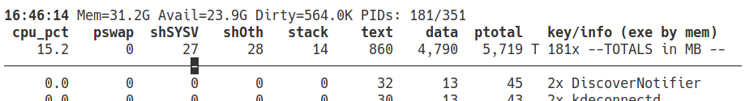

# pmemstat - Proportional Memory Status

pmemstat is a tool to show the detailed **proportional** memory use of Linux process by digesting:
* `/proc/{PID}/smaps_rollup`
* `/proc/{PID}/smaps`

Reporting proportional memory avoids overstated memory use by double counting memory that is shared between processes.

`pmemstat`'s grouping feature rolls up the resources of multiple processes of a feature (e.g., a browser) to make the total impact much more apparent.

Its looping features allow monitoring for changes and memory growth which may be "leaks".  Since most memory leaks are leaks of heap memory, segregating memory by types makes identifying leaks faster and more certain.

**In version 2.0, `pmemstat` has many new features including**:
* In its "window" mode, `pmemstat` updates the terminal in place (using "curses") rather than scrolling.
* Showing CPU usage, too, which makes `pmemstat` a viable alternative to `top` for regular us (although more specialized and still focused on accurate memory representation).
* Enables killing processes selected visually and confirmation when they are really gone.
* And a number of new options that can be changed while still running if in window mode.

## Installation
Installation is left to user ingenuity, mostly.  There is an included script designed to install a single-file version of `pmemstat` to `~/.local/bin/.` if that directory is on your path.  View the `deploy` script and use (possibly with modification) if it is useful.
> If not already installed, `deploy` will install `stickytape` to create the single-file version of `pmemstat`.
## Usage
```
usage: pmemstat [-h] [-D] [-C] [-g {exe,cmd,pid}] [-f] [-k MIN_DELTA_KB] [-l LOOP_SECS]
                   [-L CMDLEN] [-t TOP_PCT] [-n] [-o] [-u {MB,mB,KB,human}] [-R]
                   [-s {mem,cpu,name}] [-/ SEARCH] [-W]
                   [pids ...]

positional arguments:
  pids                  list of pids/groups (none means every accessible pid)

options:
  -h, --help            show this help message and exit
  -D, --debug           debug mode (the more Ds, the higher the debug level)
  -C, --no-cpu          do NOT report percent CPU (only in window mode)
  -g {exe,cmd,pid}, --groupby {exe,cmd,pid}
                        grouping method for presenting rows
  -f, --fit-to-window   do not overflow window [if -w]
  -k MIN_DELTA_KB, --min-delta-kb MIN_DELTA_KB
                        minimum delta KB to show again [dflt=100 if DB else 1000
  -l LOOP_SECS, --loop LOOP_SECS
                        loop interval in secs [dflt=5 if -w else 0]
  -L CMDLEN, --cmdlen CMDLEN
                        max shown command length [dflt=36 if not -w]
  -t TOP_PCT, --top-pct TOP_PCT
                        report group contributing to top pct of ptotal [dflt=100]
  -n, --numbers         show line numbers in report
  -o, --others          collapse shSYSV, shOth, stack, text into "other"
  -u {MB,mB,KB,human}, --units {MB,mB,KB,human}
                        units of memory [dflt=MB]
  -R, --no-rise         do NOT raise change/adds to top (only in window mode)
  -s {mem,cpu,name}, --sortby {mem,cpu,name}
                        grouping method for presenting rows
  -/ SEARCH, --search SEARCH
                        show items with search string in name
  -W, --no-window       show in "curses" window [disables: -D,-t,-L]

```
Explanation of some options and arguments:
* `-g {exe,cmd,pid}, --groupby {exe,cmd,pid}` -  select the grouping of memory stats for reporting.
    * `exe` - group by basename of the executable (the default)
    * `cmd` - group by the truncated command line (use `-L CMDLEN` to choose length)
    * `pid` - group by one process
* `-k MIN_DELTA_KB, --min-delta-kb MIN_DELTA_KB` - when looping, how much change in memory use is required to show the grouping in subsequent loops; note:
    * a positive `MIN_DELTA_KB` means the total memory of the groupin must **grow** by that amount (in KB)
    * a non-positive `MIN_DELTA_KB` means the total memory of the grouping must **change** by that amount (in KB)
* `pids` - the positional arguments may be pids (i.e., numbers) or the names of executables (as shown by `-gexe`) 


# Example Usage with Explanation of Output


On in window loop, we see
* a **leader line** with:
    * the current time
    * from `/proc/meminfo` in MB, MemTotal, MemAvailable, and Dirty
    * how many PIDs are contributing to the report vs the total number of PIDs excluding kernel threads;
        * **to see ALL pids, run:** `sudo pmemstat` 
* a **header line with the reported fields** including:
    * **pswap** - proportional use of swap (per smaps_rollup)
    * **shSYSV** - proprotional use of System V shared memory (per smaps)
    * **shOth** - proportional use of other shared memory (per smaps)
    * **stack** - exclusive use of stack memory per smaps
    * **text** - proportional use of memory for text (i.e., the read-only binary code, per smaps)
    * **data** - exclusive use of memory for data (i.e., exclusively used of "heap" memory, per smaps)
    * **ptotal** - proportional use of memory of all categories (i.e, sum of all columns to the left except **pswap**, per smaps)
    * (sometimes) **pss** - proportional use of memory (per smaps_rollup)
    * *empty* - type of the entry which may be:
        * **T** - the grand total
        * **A** - a newly added grouping
        * **O** - combined overflow groupings below the `--top-pct` threshold (only on first loop)
        * **+-{number}K** - number of KB of change in **ptotal** (only on subsequent loops)
    * **key/info** which is a quantifier plus the grouping key. The quantifier may be:
        * **{PID}** - when the grouping line represents one process (for option `-gexe`).
        * **{num}x** - where {num} is the number of processes in the grouping.
        
## Help Screen (Window Mode)
In window mode, press 'h' to enter the help screen which looks like:


**Notes:**
* There are a number of navigation keys (mostly following vim conventions); in the help screen, they apply to help screen; otherwise, they apply to main screen.
* Below the line, there are a number of keys/options; when you type an option key (e.g, "c"), it will highlight the next option value (e.g., "off"); when you change options, they will be applied to the next loop of the main menu.
    * These option keys can be used in the main menu (e.g., pressing "c" will change hide or reveal the CPU column w/o entering the help screen).
    
## Kill Mode (Window Mode)
Pressing "K" enter "Kill Mode" where you use the navigation keys to highlight a row, and then press ENTER to kill the process(es) represented by that row.

## Scroll Position (Window Mode)

Sometimes, the horizontal line between the header and scrollable region has a reverse video block (under the "27" in this case):


**Notes:**
* When there is no block, the scrolled document does not overflow the scrollable region.
* When there is a block, its position indicates:
    * **Leftmost** - At the top of the document.
    * **Rightmost** - At the bottom of the document.
    * **Between Leftmost and Rightmost** - At percentage of the document approximated by its position from Left (0%) to Right (100%).

# Quirks and Details
* **pmapstat** shows only the processes you have permission to see; to see all processes, run as *root*.
* **pswap** seems to be only provided by the `smaps_rollups` file, and thus it may be slightly out of sync with the data gathered by `smaps`.
* the **ptotal** (from 'smaps') and **pss** (from `smaps_rollups` and usually hiddent) seem differ more than expected but they seem to be very close.
* after the first loop, **pss** is used to initially filter groupings that will not qualify for display (and then **ptotal** is checked.  This means subsequent loops to be very efficient by avoid reading the `smaps`).
* the "exe" value comes from the command line (based `/proc/{PID}/cmdline` which is a bit funky). Firstly, the leading path is stripped; secondly, if the resulting executable is a script interpreter (e.g., python, perl, bash, ...) AND the first argument seems to be a full path (i.e., starts with "/"), then the "exe" will be represented as "{interpreter}->{basename(script)}".  For example, "python3->memstat" in the example above.


# Test Program and Test Suggestions
The C program, `memtest.c` is included and can be compiled by running `cc memtest.c -o memtest`.  This program:
* regularly allocates more memory of all types
* can be run several times simultaneous,
* will share SysV shared memory and memory mapped files,

When running `pmemstat` to monitor its memory use and changes, you should use `-uKB` and `-k{small-number}` so that you can "see" the very modest memory use of the test program and its changes.

Running a number of sleeps of various durations in the background in a loop, plus one foreground sleep, can make for a robustness tests with lots of processes coming and going.  There are many "races" (i.e., a process may appear in `/proc`, but its`smaps` is gone), and this test helps ensure the races are handled properly.