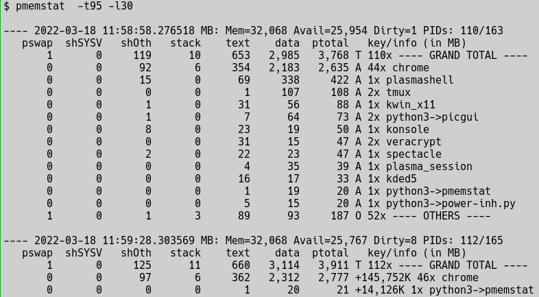

# pmemstat - Proportional Memory Status

pmemstat is a tool to show the detailed **proportional** memory use of Linux process by digesting:
* `/proc/{PID}/smaps_rollup`
* `/proc/{PID}/smaps`

Reporting on proportional use avoids double counting memory and overestimating the memory expense of a program or collection of programs.

The grouping features of this tool make it easier to attribute memory pressure to the real "memory hogs" because memory use is not obscured by splitting the cost among many processes that would otherwise have to aggregated visually/manually.

The looping features of this tool allow monitoring for changes and memory growth which may be "leaks".  Since most memory leaks are leaks of heap memory, segregating memory by types makes identifying leaks faster and more certain.

## Usage
```
usage: pmemstat [-h] [-D] [-g {exe,cmd,pid}] [-k MIN_DELTA_KB] [-l LOOP_SECS]
                [-L CMDLEN] [-t TOP_PCT] [-u {MB,mB,KB}]
                [pids [pids ...]]

positional arguments:
  pids                  list of pids/groupings (none means all we can read)

optional arguments:
  -h, --help            show this help message and exit
  -D, --debug           debug mode (the more Ds, the higher the debug level)
  -g {exe,cmd,pid}, --groupby {exe,cmd,pid}
                        grouping method for presenting rows
  -k MIN_DELTA_KB, --min-delta-kb MIN_DELTA_KB
                        minimum percent KB to show again [dflt=100 if DB else
                        1000
  -l LOOP_SECS, --loop LOOP_SECS
                        loop interval in seconds [dflt=0]
  -L CMDLEN, --cmdlen CMDLEN
                        max command line length for reporting/grouping
                        [dflt=36]
  -t TOP_PCT, --top-pct TOP_PCT
                        report grouping contributing to top pct of ptotal
                        [dflt=100]
  -u {MB,mB,KB}, --units {MB,mB,KB}
                        units of memory [dflt=MB]
```
Explanation of some options and arguments:
* `-g {exe,cmd,pid}, --groupby {exe,cmd,pid}` -  select the grouping of memory stats for reporting.
    * `exe` - group by basename of the executable (the default)
    * `cmd` - group by the truncated command line (use `-L CMDLEN` to choose length)
    * `pid` - group by one process
* `-k MIN_DELTA_KB, --min-delta-kb MIN_DELTA_KB` - when looping, how much change in memory use is required to show the grouping in subsequent loops; note:
    * a positive `MIN_DELTA_KB` means the total memory of the groupin must **grow** by that amount (in KB)
    * a non-positive `MIN_DELTA_KB` means the total memory of the grouping must **change** by that amount (in KB)
* `pids` - the positional arguments may be pids (i.e., numbers) or the names of executables (as shown by `-gexe`) 


# Example Usage with Explanation of Output


On every loop, we see
* a **leader line** with:
    * the current time
    * from `/proc/meminfo` in MB, MemTotal, MemAvailable, and Dirty
    * how many PIDs are contributing to the report vs the total number of PIDs excluding kernel threads; if `pmemstat` is run as root, then all  PIDs can be seen; otherwise, you will be restrict to those for which you have permissions.
* a **header line with the reported fields** including:
    * **pswap** - proportional use of swap (per smaps_rollup)
    * **shSYSV** - proprotional use of System V shared memory (per smaps)
    * **shOth** - proportional use of other shared memory (per smaps)
    * **stack** - exclusive use of stack memory per smaps
    * **text** - proportional use of memory for text (i.e., the read-only binary code, per smaps)
    * **data** - exclusive use of memory for data (i.e., exclusively used of "heap" memory, per smaps)
    * **ptotal** - proportional use of memory of all categories (i.e, sum of all columns to the left except **pswap**, per smaps)
    * (sometimes) **pss** - proportional use of memory (per smaps_rollup)
    * *empty* - type of the entry which may be:
        * **T** - the grand total
        * **A** - a newly added grouping
        * **O** - combined overflow groupings below the `--top-pct` threshold (only on first loop)
        * **+-{number}K** - number of KB of change in **ptotal** (only on subsequent loops)
    * **key/info** which is a quantifier plus the grouping key. The quantifier may be:
        * **{PID}** - when the grouping line represents one process (for option `-gexe`).
        * **{num}x** - where {num} is the number of processes in the grouping.

# Quirks and Details
* **pmapstat** shows only the processes you have permission to see; to see all processes, run as *root*.
* **pswap** seems to be only provided by the `smaps_rollups` file, and thus it may be slightly out of sync with the data gathered by `smaps`.
* the **ptotal** (from 'smaps') and **pss** (from `smaps_rollups` and usually hiddent) seem differ more than expected but they seem to be very close.
* after the first loop, **pss** is used to initially filter groupings that will not qualify for display (and then **ptotal** is checked.  This means subsequent loops to be very efficient by avoid reading the `smaps`).
* the "exe" value comes from the command line (based `/proc/{PID}/cmdline` which is a bit funky). Firstly, the leading path is stripped; secondly, if the resulting executable is a script interpreter (e.g., python, perl, bash, ...) AND the first argument seems to be a full path (i.e., starts with "/"), then the "exe" will be represented as "{interpreter}->{basename(script)}".  For example, "python3->memstat" in the example above.

# Test Program and Test Suggestions
The C program, `memtest.c` is included and can be compiled by running `cc memtest.c -o memtest`.  This program:
* regularly allocates more memory of all types
* can be run several times simultaneous,
* will share SysV shared memory and memory mapped files,

When running `pmemstat` to monitor its memory use and changes, you should use `-uKB` and `-k{small-number}` so that you can "see" the very modest memory use of the test program and its changes.

Running a number of sleeps of various durations in the background in a loop, plus one foreground sleep, can make for a robustness tests with lots of processes coming and going.  There are many "races" (i.e., a process may appear in `/proc`, but its`smaps` is gone), and this test helps ensure the races are handled properly.